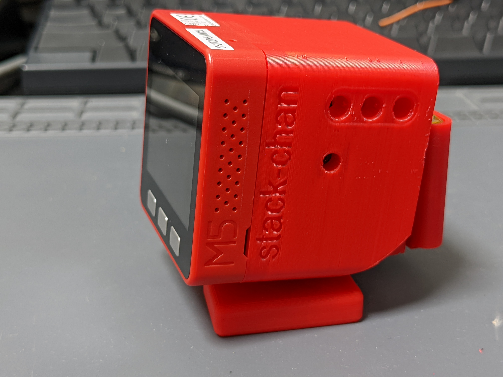

# ｽﾀｯｸﾁｬﾝ ケース

[Enblish](./README.md)

現在、[ケースデータ](https://a360.co/3gcw960)はFusion360で作成しています。

## 組み立て

### パーツ

* 3Dプリントしたケース
  * 外殻(Shell)
  * 足(Feet)
  * ブラケット(Bracket)
* M5Stack Core (Basic/Gray/Go/Fireのいずれか), またはCore2
* [Stack-chan 基板](../schematics/README.md)
* サーボモータ2つ
  * 現在次のモータで動作確認しています
    * シリアルサーボ RS30Xシリーズ(TTL通信)
    * PWMサーボ SG-90
* PH 2ピンのケーブル付きのバッテリー(3.7V [400mAhのリチウムポリマーバッテリー](https://www.sengoku.co.jp/mod/sgk_cart/detail.php?code=EEHD-4YZL)でテスト済み)
* ねじ
  * M2 4mm * 10本
  * M2 8mm * 2本
  * M3 14mm * 2本

### 組み立て方

(RS304MDを使った場合です。SG-90も似ています)

#### ブラケット

* サーボから4本のねじを取り外します。モータの内部にごみが入らないように注意してください。
* サーボをブラケットに差し込み、4本のねじで固定します。その後ホーンを取り付けます。

#### 外殻と足

* ねじで足と外殻を固定します(それぞれM2-4mm * 4本, M2-8mm * 1本)

#### M5Stackと基板

* バッテリーをブラケットのポケットに挿入します。
* サーボとバッテリーのケーブルを基板に接続します。コネクタの向きが正しいか確認してください。
* 基板をねじで固定します(M2-4mm * 2本)。
* M5Stackをロボットにスタックしてねじで固定します(M3-14mm * 2本)。
